<div align="center">


# Secure Bank — Full Stack Banking Management System

**An enterprise-grade, multi-role banking platform built with Flask & MySQL.**  
Handles real-world banking operations: accounts, transactions, loans, and role-based access — all in one secure system.

<br/>

[](https://python.org)
[](https://flask.palletsprojects.com)
[](https://mysql.com)
[](https://getbootstrap.com)
[](https://developer.mozilla.org/en-US/docs/Web/JavaScript)
[](https://sqlalchemy.org)
[](LICENSE)
[]()

<br/>

 · [Documentation](#) · [Report Bug](#) · [Request Feature](#)

</div>

---

## Overview

Secure Bank is a **production-architecture banking management system** that simulates real-world financial operations. It supports three distinct user roles — Admin, Staff, and Client — each with tailored dashboards, permissions, and workflows.

Built with Flask's Blueprint architecture, SQLAlchemy ORM, and a normalized MySQL schema, this system demonstrates advanced full-stack engineering: ACID-compliant transactions, EMI-based loan processing, audit logging, CSRF protection, and bcrypt password security.

> **Portfolio Note:** This project is deployed as a portfolio showcase demonstrating enterprise-grade backend architecture, financial domain logic, and security-conscious development practices.

---

## Table of Contents

- [Screenshots](#screenshots)
- [Key Features](#key-features)
- [Tech Stack](#tech-stack)
- [System Architecture](#system-architecture)
- [Role-Based Access Control](#role-based-access-control)
- [Folder Structure](#folder-structure)
- [Database Schema](#database-schema)
- [Security Implementation](#security-implementation)
- [Installation & Setup](#installation--setup)
- [Usage Guide](#usage-guide)
- [Diagrams & Flowcharts](#diagrams--flowcharts)
- [Future Roadmap](#future-roadmap)
- [Deployment](#deployment)
- [Author](#author)

---

## Screenshots

> **Recruiter Priority Order:** Admin Dashboard → Client Dashboard → Loan Management → Transaction History → Staff Dashboard → Transfer Page → Account Management → Login

### 🏠 Landing & Authentication

| Landing Page | Login |
|:---:|:---:|
| 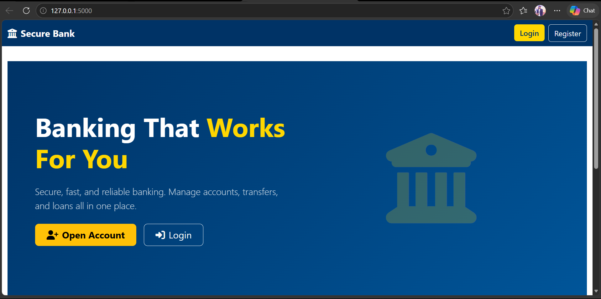 | 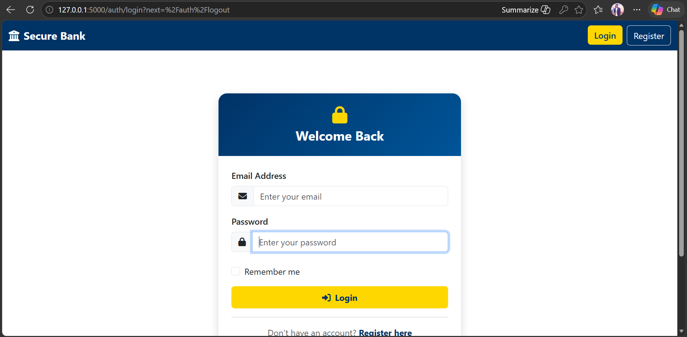 |

---

### 🛡️ Admin Control Panel

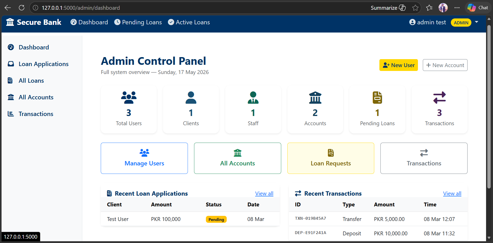

*Full system overview with real-time statistics: total users, accounts, pending loans, and recent activity feed.*

---

### 👤 Client Experience

| Client Dashboard | All Accounts |
|:---:|:---:|
| 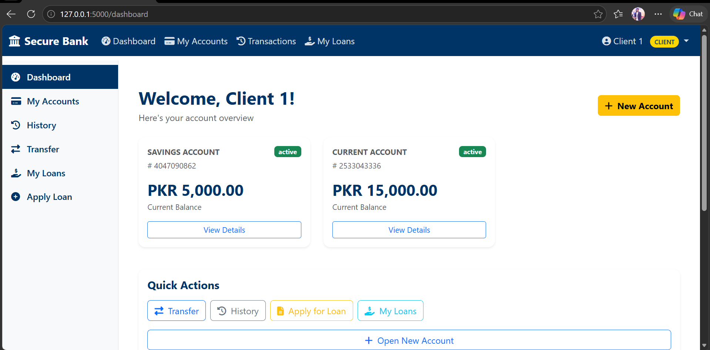 | 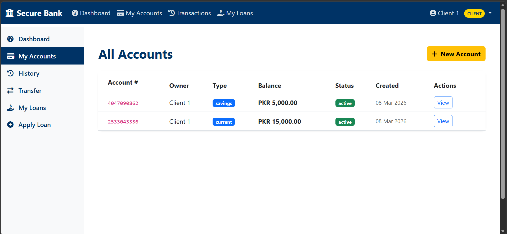 |

| Transaction History | Transfer Money |
|:---:|:---:|
| 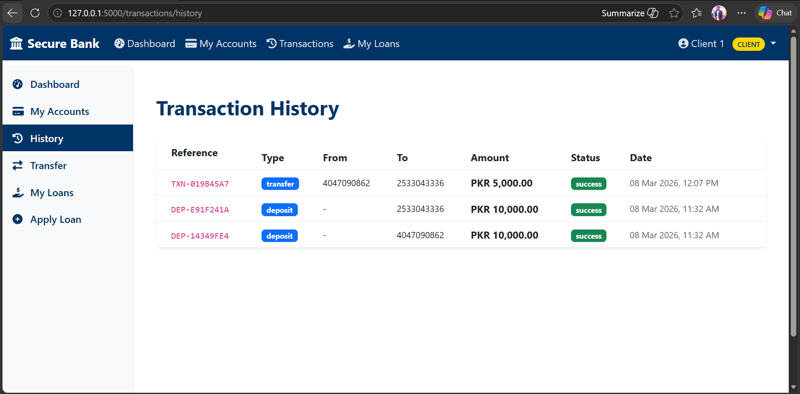 | 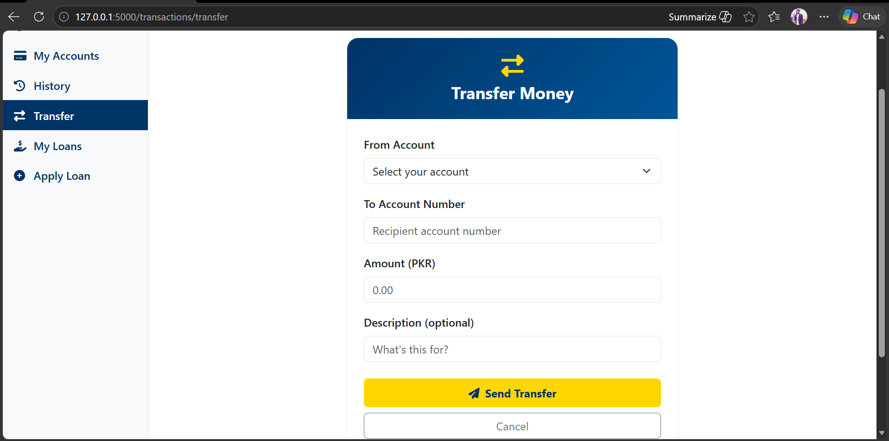 |

---

### 💳 Loan Management

| Apply for Loan | My Loans | Pending Applications (Admin) |
|:---:|:---:|:---:|
| 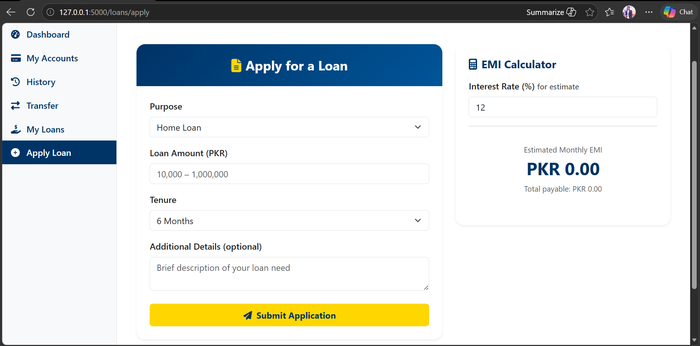 | 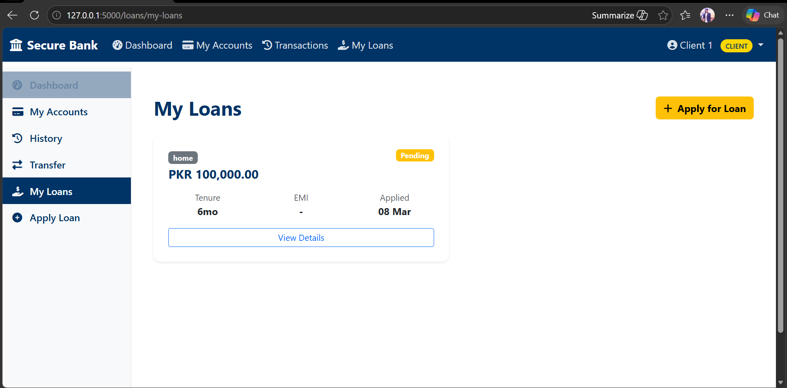 | 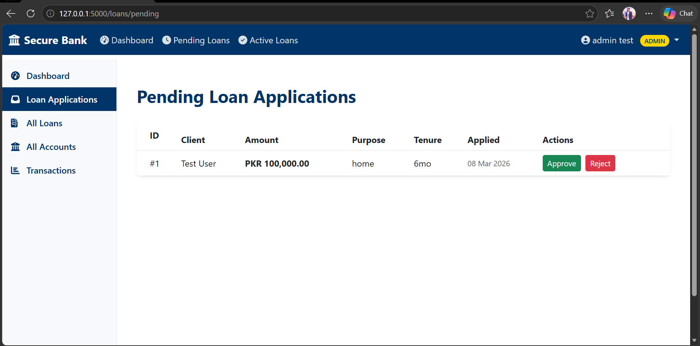 |

---

### 👔 Staff Operations

| Staff Dashboard | Client Management | Create Bank Account |
|:---:|:---:|:---:|
| 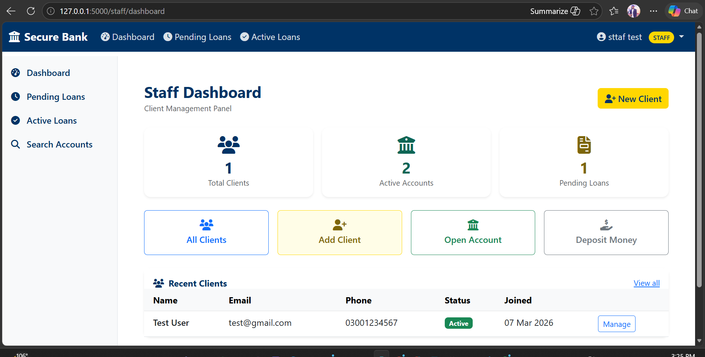 | 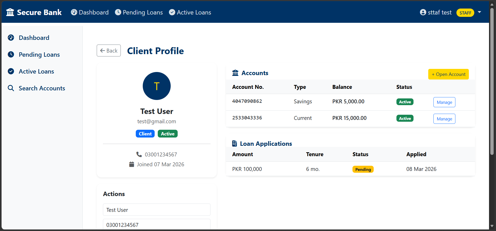 | 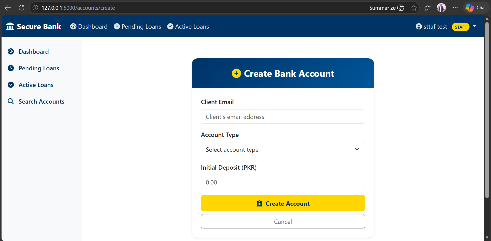 |

---

## Key Features

### Account Management
- Auto-generated unique 10-digit account numbers
- Three account types: **Savings** (min PKR 500), **Current** (min PKR 1,000), **Fixed Deposit**
- Account status lifecycle: Active → Frozen → Closed
- Interest rate configuration per account type

### Transaction Processing
- **Deposits** and **Withdrawals** (Staff/Admin only) with unique reference IDs (`DEP-XXXXXXXX`, `WDR-XXXXXXXX`)
- **Peer-to-peer Transfers** (Client-initiated) with real-time balance validation
- Full ACID compliance — atomic commits with automatic rollback on failure
- IP address logging on every transaction for audit compliance

### Loan Management System
- Client loan applications: PKR 10,000 – 1,000,000 across 6 to 60 month tenures
- Staff/Admin approval workflow with custom terms (amount, interest rate, tenure)
- Automatic **EMI calculation** using compound interest formula: `EMI = [P × R × (1+R)^N] / [(1+R)^N - 1]`
- Month-by-month repayment schedule with principal/interest split
- Loan status tracking: Pending → Approved/Rejected → Active → Closed

### Authentication & Sessions
- Bcrypt password hashing (cost factor 12)
- Strong password policy enforcement (8+ chars, mixed case, digits, special characters)
- 30-minute session timeout with HTTP-only, SameSite cookies
- Login audit trail with IP address and timestamp recording

### Role-Based Dashboards
- Context-aware navigation menus per role
- Admin: system-wide statistics + user/account/loan/transaction management
- Staff: client management panel + loan approval queue
- Client: personal accounts overview + quick-action shortcuts

---

## Tech Stack

| Layer | Technology | Purpose |
|-------|-----------|---------|
| **Backend** | Python 3.11, Flask 2.3 | Web framework, routing, business logic |
| **ORM** | SQLAlchemy + Flask-Migrate | Database abstraction, schema migrations |
| **Database** | MySQL 8.0 | Primary relational data store |
| **Frontend** | Bootstrap 5, Jinja2, JavaScript | UI components, server-side templating |
| **Auth** | Flask-Login, Werkzeug/bcrypt | Session management, password hashing |
| **Security** | Flask-WTF (CSRF), Flask-Limiter | Form protection, rate limiting |
| **Forms** | WTForms | Server-side validation |
| **Dev Tools** | python-dotenv, Flask-Migrate | Environment config, DB migrations |

---

## System Architecture

```
┌─────────────────────────────────────────────────────────────┐
│                        CLIENT LAYER                         │
│              Browser (HTML / Bootstrap 5 / JS)              │
└──────────────────────────┬──────────────────────────────────┘
                           │  HTTP Requests
┌──────────────────────────▼──────────────────────────────────┐
│                     CONTROLLER LAYER                        │
│             Flask Blueprints — Business Logic               │
│                                                             │
│  auth.py  │  admin.py  │  staff.py  │  accounts.py         │
│  loans.py │  transactions.py        │  main.py             │
└──────────────────────────┬──────────────────────────────────┘
                           │  SQLAlchemy ORM
┌──────────────────────────▼──────────────────────────────────┐
│                       MODEL LAYER                           │
│          User · Account · Transaction · Loan · AuditLog     │
└──────────────────────────┬──────────────────────────────────┘
                           │  SQL Queries
┌──────────────────────────▼──────────────────────────────────┐
│                     DATABASE LAYER                          │
│                   MySQL 8.0 — 5 Tables                      │
└─────────────────────────────────────────────────────────────┘
```

**Blueprint URL Routing:**

| Blueprint | Prefix | Access |
|-----------|--------|--------|
| `auth_bp` | `/auth` | Public + Authenticated |
| `main_bp` | `/` | Public + Authenticated |
| `accounts_bp` | `/accounts` | Client / Staff / Admin |
| `transactions_bp` | `/transactions` | Client / Staff / Admin |
| `loans_bp` | `/loans` | Client / Staff / Admin |
| `admin_bp` | `/admin` | Admin Only |
| `staff_bp` | `/staff` | Staff + Admin |

---

## Role-Based Access Control

### 🔴 Admin
Full system access — user lifecycle management, freeze/unfreeze accounts, system-wide audit logs, all transactions and loan data.

### 🟡 Staff
Client-facing operations — create and manage client accounts, deposit/withdraw cash, approve or reject loan applications, view client profiles.

### 🟢 Client
Self-service — view personal accounts and balances, initiate transfers, apply for loans, track loan status and EMI schedule, view transaction history.

```
Role Hierarchy:
  Admin  ⊃  Staff  ⊃  Client
```

Custom route decorators (`@admin_required`, `@staff_required`) enforce access at the route level, with additional ownership verification inside handlers.

---

## Folder Structure

```
banking_project/
├── banking_app/
│   ├── __init__.py              # Application factory, extension init, blueprint registration
│   ├── config.py                # Dev / Test / Prod configuration classes
│   ├── models.py                # SQLAlchemy ORM models (User, Account, Transaction, Loan, AuditLog)
│   ├── routes/
│   │   ├── auth.py              # Login, logout, profile
│   │   ├── main.py              # Dashboard routing logic
│   │   ├── accounts.py          # Account CRUD
│   │   ├── transactions.py      # Deposits, withdrawals, transfers
│   │   ├── loans.py             # Application, approval, rejection, EMI
│   │   ├── admin.py             # Admin panel operations
│   │   └── staff.py             # Staff client management
│   ├── templates/
│   │   ├── base.html            # Master layout (navbar, sidebar, flash messages)
│   │   ├── main/                # Dashboards per role
│   │   ├── auth/                # Login, profile
│   │   ├── accounts/            # Account list, details, create
│   │   ├── transactions/        # Transfer, history, deposit, withdraw
│   │   ├── loans/               # Apply, my loans, details, pending, approve, reject
│   │   ├── admin/               # Admin panel pages
│   │   ├── staff/               # Staff panel pages
│   │   └── errors/              # 404, 500
│   ├── forms/
│   │   └── loan_forms.py        # WTForms: LoanApplicationForm, LoanApprovalForm, LoanRejectionForm
│   └── utils/
│       └── loan_calculator.py   # EMI calculation, repayment schedule, eligibility checks
├── .env                         # Secret credentials (never committed)
├── .env.example                 # Environment variable template
├── .gitignore
├── requirements.txt
└── run.py                       # Application entry point
```

---

## Database Schema

**5 Tables | Normalized to 3NF | Foreign Keys with Cascade/Set Null**

```
users
├── id, full_name, email (UNIQUE), phone (UNIQUE)
├── password_hash, role ENUM(admin|staff|client)
├── is_active, created_at, last_login

accounts
├── id, account_number (UNIQUE, 10-digit)
├── account_type ENUM(savings|current|fixed)
├── balance DECIMAL(15,2), status ENUM(active|frozen|closed)
├── interest_rate, created_at
└── user_id → users.id (CASCADE DELETE)

transactions
├── id, transaction_id (UUID-based, UNIQUE)
├── amount DECIMAL(15,2), transaction_type ENUM(deposit|withdrawal|transfer)
├── status ENUM(success|failed|pending)
├── description, timestamp, completed_at, ip_address
├── from_account_id → accounts.id (SET NULL)
└── to_account_id   → accounts.id (SET NULL)

loans
├── id, amount_requested, amount_approved
├── interest_rate, tenure_months, emi_amount
├── purpose, description, status ENUM(pending|approved|rejected|active|closed)
├── applied_at, approved_at
├── user_id     → users.id (CASCADE DELETE)
└── approved_by → users.id (SET NULL)

audit_logs
├── id, action, ip_address, timestamp
├── details (JSON string)
└── user_id → users.id (SET NULL)
```

**Key Relationships:**
- `users` 1→N `accounts` (cascade delete)
- `users` 1→N `loans` as borrower (cascade delete)
- `users` 1→N `loans` as approver (set null)
- `accounts` 1→N `transactions` as sender and receiver (set null)

---

## Security Implementation

| Layer | Implementation |
|-------|---------------|
| **Password Storage** | Bcrypt hashing, cost factor 12 — plaintext never stored |
| **Password Policy** | 8+ chars, uppercase, lowercase, digit, special character required |
| **CSRF Protection** | Flask-WTF token on every form submission |
| **Session Security** | HTTP-only cookies, SameSite policy, 30-min timeout, strong session protection |
| **Rate Limiting** | Flask-Limiter, IP-based tracking per endpoint |
| **SQL Injection** | SQLAlchemy ORM parameterized queries — no raw SQL |
| **XSS Prevention** | Jinja2 auto-escaping on all template output |
| **Access Control** | `@login_required`, `@admin_required`, `@staff_required` decorators + ownership checks |
| **Audit Logging** | Every critical action logged with user ID, IP, timestamp |
| **Secrets Management** | All credentials via `.env` — never hardcoded |

---

## Installation & Setup

### Prerequisites

- Python 3.11+
- MySQL 8.0+
- pip + virtualenv

### 1. Clone the Repository

```bash
git clone https://github.com/yourusername/secure-bank.git
cd secure-bank
```

### 2. Create Virtual Environment

```bash
python -m venv venv
source venv/bin/activate        # macOS/Linux
venv\Scripts\activate           # Windows
```

### 3. Install Dependencies

```bash
pip install -r requirements.txt
```

### 4. Configure Environment

```bash
cp .env.example .env
```

Edit `.env` with your values:

```env
DB_USERNAME=your_mysql_user
DB_PASSWORD=your_mysql_password
DB_HOST=localhost
DB_PORT=3306
DB_NAME=banking_system

SECRET_KEY=your-random-secret-key
FLASK_ENV=development
FLASK_APP=run.py
```

Generate a secure secret key:
```bash
python -c "import secrets; print(secrets.token_hex(32))"
```

### 5. Initialize the Database

```bash
# Create the MySQL database
mysql -u root -p -e "CREATE DATABASE banking_system;"

# Run migrations
flask db upgrade
```

### 6. Run the Application

```bash
python run.py
```

Visit `http://127.0.0.1:5000`

---

## Usage Guide

### Default Test Credentials

> Create your first admin account via the Flask shell on first run:

```python
flask shell
>>> from banking_app.models import User, db
>>> admin = User(full_name="Admin", email="admin@bank.com", role="admin")
>>> admin.set_password("Admin@1234")
>>> db.session.add(admin)
>>> db.session.commit()
```

### Typical Workflow

```
1. Admin logs in → creates Staff account + Creates Client account
2. Staff logs in → creates Client account + opens bank account with initial deposit
3. Client logs in → views accounts, transfers funds, applies for loan
4. Staff/Admin → reviews pending loan applications → approves with terms
5. Loan amount auto-disbursed to client account → EMI schedule generated
```

---

### System Workflow

```
Client → Login → Dashboard
                 ├── View Accounts & Balances
                 ├── Transfer Money → Validate → Deduct/Credit → Log
                 ├── Apply for Loan → Pending Queue
                 └── View Transaction History

Staff  → Login → Dashboard
                 ├── Manage Clients
                 ├── Deposit / Withdraw (for client)
                 └── Approve / Reject Loans → Disburse Funds

Admin  → Login → Control Panel
                 ├── Create Users (Admin/Staff/Client)
                 ├── Freeze/Unfreeze Accounts
                 └── Full System Audit View
```

### Authentication Flow

```
POST /auth/login
     │
     ▼
Validate credentials (bcrypt verify)
     │
     ├── Fail → Log failed attempt (IP, timestamp) → Flash error
     │
     └── Pass → Create session → Log success → Redirect to role dashboard
```

### Transaction Flow (Transfer)

```
Client submits transfer form
     │
     ├── Validate source account ownership
     ├── Check account status = ACTIVE
     ├── Validate destination account exists
     ├── Check sufficient balance
     │
     └── BEGIN TRANSACTION
          ├── Create Transaction record (PENDING)
          ├── Deduct from source account
          ├── Credit to destination account
          ├── Update status → SUCCESS + completed_at
          └── COMMIT  (or ROLLBACK on any failure)
```

### Loan Approval Flow

```
Client applies → Loan.status = PENDING
     │
Staff/Admin reviews
     │
     ├── APPROVE → Set amount_approved, interest_rate, emi_amount
     │             → Create DEPOSIT transaction → Credit client account
     │             → Log to audit_logs → Notify client
     │
     └── REJECT  → Set rejection reason → Log → Notify client
```

> **📌 Placement Guide:** Place the ER diagram immediately after the Database Schema section. Place authentication and transaction flows after the Security section. Export as PNG and host in a `/docs/diagrams/` folder within the repo.

---

## Future Roadmap

| Priority | Feature | Description |
|----------|---------|-------------|
| 🔴 High | Automated Testing | pytest unit + integration test suite for all critical paths |
| 🔴 High | Password Reset | Email-based token reset flow with 1-hour expiry |
| 🔴 High | Email Notifications | Transaction receipts, loan status updates, security alerts |
| 🟡 Medium | Two-Factor Authentication | TOTP-based 2FA (Google Authenticator) or SMS OTP |
| 🟡 Medium | REST API | JWT-authenticated API endpoints for mobile app integration |
| 🟡 Medium | Analytics Dashboard | Chart.js-powered graphs: transaction volume, loan approval rates |
| 🟡 Medium | Account Lockout | Auto-lock after 5 failed login attempts with timed unlock |
| 🟢 Low | Docker Deployment | Containerized multi-service setup with docker-compose |
| 🟢 Low | Redis Caching | Cache user profiles and dashboard stats to reduce DB load |
| 🟢 Low | Celery Background Jobs | Async email delivery, report generation, EMI reminders |
| 🟢 Low | AI Fraud Detection | ML-based anomaly detection on transaction patterns |

---

## Deployment

### Option A — Railway (Recommended for Portfolio)

```bash
# Install Railway CLI
npm install -g @railway/cli

# Deploy
railway login
railway init
railway add mysql
railway up
```

### Option B — VPS (DigitalOcean / AWS EC2)

```bash
# Install Gunicorn
pip install gunicorn

# Run production server
gunicorn -w 4 -b 0.0.0.0:5000 run:app
```

**Nginx reverse proxy config:**
```nginx
server {
    listen 80;
    server_name yourdomain.com;

    location / {
        proxy_pass http://127.0.0.1:5000;
        proxy_set_header Host $host;
        proxy_set_header X-Real-IP $remote_addr;
    }
}
```

**SSL (Let's Encrypt):**
```bash
sudo certbot --nginx -d yourdomain.com
```

### Option C — Docker

```dockerfile
FROM python:3.11-slim
WORKDIR /app
COPY requirements.txt .
RUN pip install -r requirements.txt
COPY . .
EXPOSE 5000
CMD ["gunicorn", "-w", "4", "-b", "0.0.0.0:5000", "run:app"]
```

**Production `.env` checklist:**
- [ ] `FLASK_ENV=production`
- [ ] Strong random `SECRET_KEY`
- [ ] `SESSION_COOKIE_SECURE=True`
- [ ] HTTPS/SSL configured
- [ ] Database on managed service (RDS / Cloud SQL)
- [ ] Automated daily backups enabled

---

## Project Stats

```
Lines of Code       ~3,500+
Python Files        15+
HTML Templates      25+
Database Tables     5
API Endpoints       30+
User Roles          3
Complexity Level    Advanced Intermediate
Portfolio Score     8.5 / 10
```

---

## Author

<div align="center">

**[ Muhammad Abdullah ]**

*Full Stack Developer | Python · Flask · MySQL · JavaScript*

[](https://github.com/abdullaharain-codes)
[](https://linkedin.com/in/muhammad-abdullah-a13289339)
[](mailto:mabdullaharain71@gmail.com)
</div>

---

## License

This project is licensed under the **MIT License** — see the [LICENSE](LICENSE) file for details.

---

<div align="center">

*If this project helped you or impressed you, please consider giving it a ⭐ — it helps with visibility and means a lot!*

**Built with precision. Designed for the real world.**

</div>